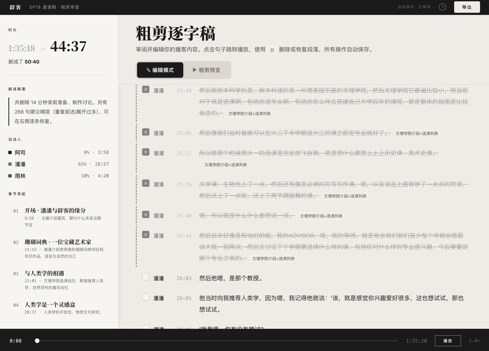
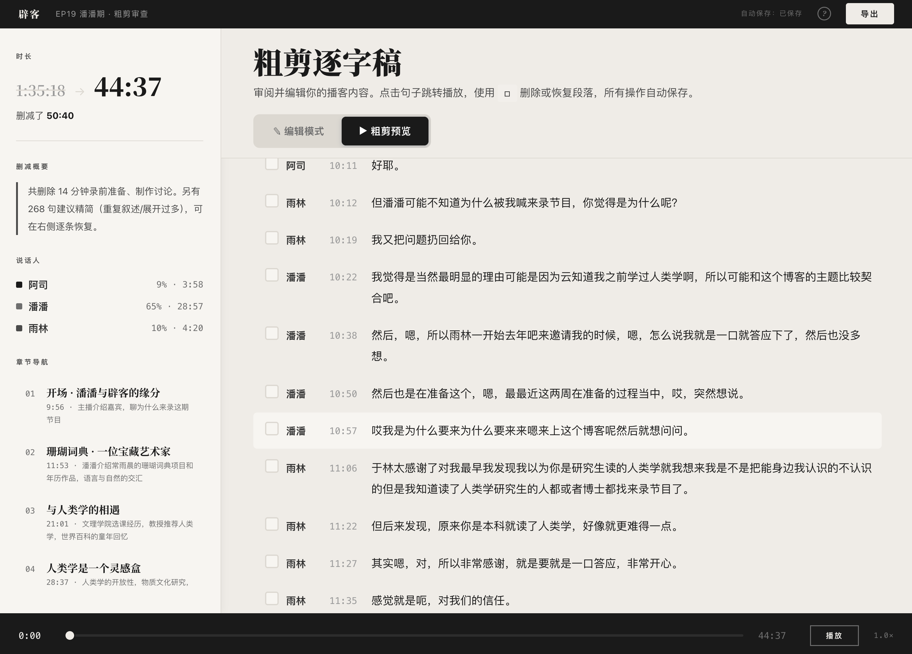

# Podcastcut

用 Claude Code Skills 构建的播客剪辑工具。
丢进原始录音，AI 自动转录、分析内容、标记删减，在浏览器里审一遍，导出，剪辑完成。

## 粗剪审查页面

设定目标时长和用户偏好，AI 预删减内容，让你更快进入精剪和高光筛选。

### 编辑模式



完整逐字稿按章节导航呈现，AI 建议删除的段落标记理由，一键恢复或追加删除。

### 粗剪预览



直接试听成品效果。粗剪完成后右上角导出json丢进Claude Code继续执行精剪。

## 安装

```bash
git clone https://github.com/chenyusi/podcastcut-skills.git
cd podcastcut-skills

# 注册 Claude Code Skills
PODCASTCUT_DIR="$(pwd)"
mkdir -p ~/.claude/skills
ln -s "$PODCASTCUT_DIR/安装"      ~/.claude/skills/podcastcut-安装
ln -s "$PODCASTCUT_DIR/剪播客"    ~/.claude/skills/podcastcut-剪播客
ln -s "$PODCASTCUT_DIR/后期"      ~/.claude/skills/podcastcut-后期
ln -s "$PODCASTCUT_DIR/质检"      ~/.claude/skills/podcastcut-质检
ln -s "$PODCASTCUT_DIR/音质处理"  ~/.claude/skills/podcastcut-音质处理

# 依赖
brew install node ffmpeg

# API Key
cp .env.example .env
# 编辑 .env，填入阿里云 DashScope API Key
```

在 Claude Code 中输入 `/podcastcut-剪播客 你的音频文件.mp3` 开始。

## 网页版 M1

静态网页入口在 `web/index.html`。当前网页链路使用阿里云：

- OSS：浏览器直传音频，生成 24 小时签名 URL
- DashScope FunASR：读取 OSS 签名 URL 做转录
- DeepSeek：分批输出粗剪/精剪删除建议
- 浏览器审查页：从 `sessionStorage` 注入逐字稿数据
- ffmpeg.wasm：在 `web/cut.html` 内生成 MP3

部署前编辑 `web/js/config.js`，填入：

```js
export const ALIYUN_DASHSCOPE_KEY = '...';
export const DEEPSEEK_KEY = '...';
export const OSS_CONFIG = {
  region: 'oss-cn-shanghai',
  bucket: 'your-bucket',
  accessKeyId: '...',
  accessKeySecret: '...',
  uploadPrefix: 'podcastcut/uploads'
};
```

OSS Bucket 需要配置 CORS，至少允许 GitHub Pages 域名：

```text
AllowedOrigin: https://dangxiaoshi.github.io
AllowedMethod: GET, PUT, POST, HEAD
AllowedHeader: *
ExposeHeader: ETag
```

M1 为了小范围内测，OSS AccessKey 仍在前端。务必使用单独 RAM 用户，并把权限限制到目标 bucket 的 `podcastcut/uploads/*`；正式开营前应改为 STS 或服务端签名。

## 流程

```
阶段 1  转录 + AI 分析
阶段 2  人工审核（粗剪审查页面）
阶段 3  剪辑执行 + 质检
阶段 4  音质处理（按说话人降噪、响度标准化）
阶段 5  后期（高光片段、片头片尾、时间戳）
```

## Skill 清单

| 命令 | 功能 |
|------|------|
| `/podcastcut-安装` | 环境准备 |
| `/podcastcut-剪播客` | 主流程 |
| `/podcastcut-质检` | 数据层 + 信号层 + 语义层质检 |
| `/podcastcut-音质处理` | 按说话人降噪、LUFS 标准化 |
| `/podcastcut-后期` | 高光、音乐、时间戳、标题 |

## 致谢

Fork 自 [@luoyuweidu1](https://github.com/luoyuweidu1) 的 [podcastcut-skills](https://github.com/luoyuweidu1/podcastcut-skills)。核心转录、分析、质检架构来自原项目，本版本在此基础上做了审查体验重设计和功能扩展。

## License

MIT
